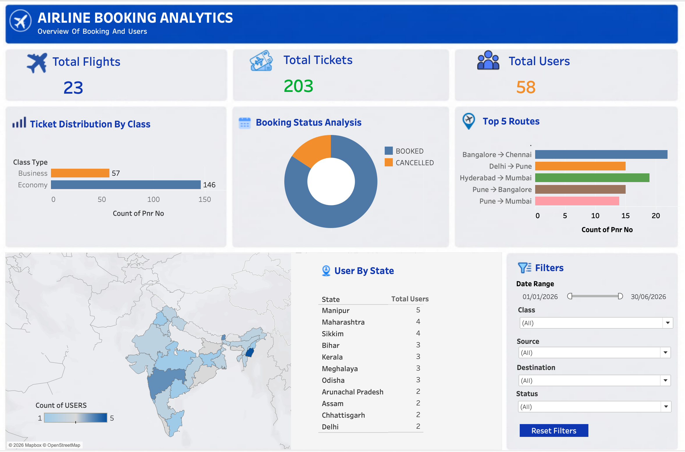
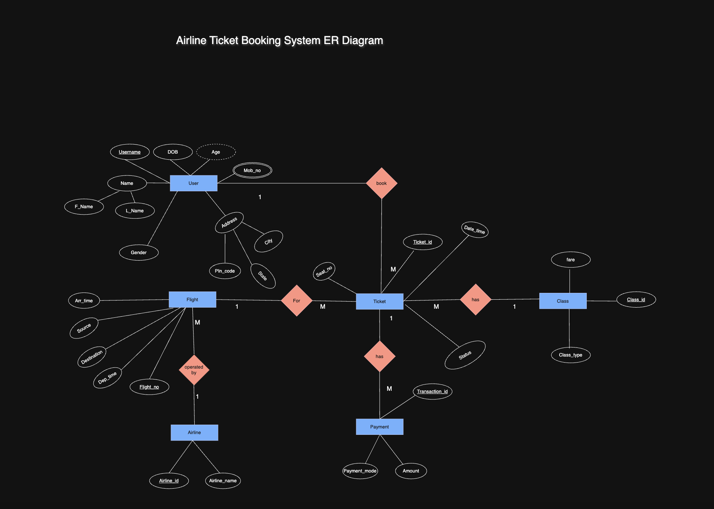

# Airline Booking Analytics Dashboard

## Overview

Airline Booking Analytics Dashboard is an end-to-end data analytics project developed using MySQL and Tableau. The project transforms transactional airline booking data into actionable business insights through interactive visualizations and KPI-driven reporting.

The dashboard enables analysis of booking behavior, route performance, class-wise ticket distribution, booking status trends, and geographic user distribution.

---

## Dashboard Preview

### Main Dashboard

[Insert Dashboard Screenshot Here]

Example:



---

## Problem Statement

Airline companies generate large volumes of booking and customer data. However, raw transactional data alone provides limited business value.

The objective of this project is to:

- Analyze booking patterns across routes and ticket classes
- Monitor booking and cancellation trends
- Identify high-demand routes
- Understand geographic distribution of customers
- Provide an interactive dashboard for business decision-making

---

## Technology Stack

| Category | Tools |
|-----------|--------|
| Database | MySQL |
| Query Language | SQL |
| Data Visualization | Tableau |
| Data Modeling | ER Diagram |
| Version Control | Git & GitHub |

---

## Database Design

The project is based on a relational database consisting of the following entities:

- Users
- Flights
- Tickets
- Payments
- Class

### Entity Relationship Diagram

[Insert ER Diagram Here]

Example:



---

## Database Schema

Key tables used in the project:

| Table | Description |
|---------|-------------|
| USERS | Customer information |
| FLIGHT | Flight details |
| TICKET | Booking records |
| PAYMENT | Payment transactions |
| CLASS | Travel class information |

---

## Dashboard Features

### KPI Metrics

- Total Flights
- Total Tickets
- Total Users

### Ticket Distribution Analysis

- Economy vs Business Class bookings

### Booking Status Analysis

- Booked tickets
- Cancelled tickets

### Route Performance Analysis

- Top performing airline routes
- Route-wise booking volume

### Geographic User Analysis

- State-wise customer distribution
- Interactive map visualization

### Interactive Filters

- Date Range
- Class Type
- Source
- Destination
- Booking Status

---

## Key Insights

- Economy class accounts for the majority of ticket bookings.
- Booking cancellations represent a relatively small share of total transactions.
- Certain city pairs consistently generate higher booking volumes.
- User concentration varies significantly across different states.

---

## SQL Concepts Used

- Joins
- Aggregate Functions
- Group By
- Order By
- Subqueries
- Filtering Conditions
- Data Analysis Queries

---

## Project Structure

```text
Airline_Booking_Analytics/
│
├── dbms_project/
│   ├── schema.sql
│   ├── data.sql
│   ├── Queries.sql
│   ├── dbms_project_report.pdf
│   ├── ER_Diagram.png
│
├── tableau/
│   ├── Airline_Booking_Analytics.twbx
│
├── images/
│   ├── dashboard_overview.png
│   ├── er_diagram.png
│
└── README.md
```

## Future Enhancements

- Revenue Analytics
- Customer Segmentation
- Predictive Booking Analysis
- Churn Prediction
- Real-Time Data Integration
- Advanced Business Intelligence Reporting

---

## Author

**Vasu**

Aspiring Data Analyst with interests in SQL, Tableau, Python, Data Visualization, and Business Analytics.

GitHub: https://github.com/Vasu618
